<div align="center">



<br />

[`email`](mailto:rodinamo2003@gmail.com) · [`linkedin`](https://www.linkedin.com/in/rodina-mohamed-konsowa/) · [`github`](https://github.com/Rodina404)

</div>

## `$ whoami`

```text
name      Rodina Mohamed
role      Software Development Engineer | AI Engineer
location  Alexandria, Egypt
degree    B.Sc. Computer Science & Engineering (AI), AIU — 2026
```

I build agentic AI systems, grounded retrieval applications, and the backend services that turn them into dependable software.

```text
current.focus  = production-grade AI agents + Model Context Protocol (MCP)
interests      = agentic systems + RAG + LLM applications + web engineering
```

## `$ systemctl --user status what-i-build`

```text
knowledge + user intent
          │
          ▼
  agent orchestration ──────► tool selection
          │                         │
          ▼                         │
 retrieval + memory ◄───────────────┘
          │
          ▼
 backend APIs + microservices
          │
          ▼
 intelligent products
```

## `$ stack --grouped`

```yaml
ai_llm:
  - LangChain, LangGraph, Agentic AI, RAG Pipelines
  - Prompt Engineering, Groq LLM APIs, FAISS, Chroma

backend:
  - Python, FastAPI, Node.js
  - REST APIs, Microservices, Modular Architecture

data:
  - PostgreSQL, MongoDB, MySQL, SQL
  - NumPy, Pandas, Scikit-learn

product_ui:
  - JavaScript, React, HTML, CSS

engineering:
  - Java, OOP, Design Patterns, Data Structures, Algorithms, Git

delivery:
  - Docker, Kubernetes, Linux
```

## `$ ls ./projects`

### `01. AI-Powered Skill Mentor`

> Graduation project · 2025–2026

A career platform that extracts skills, identifies gaps, recommends courses, builds learning direction, and matches candidates with jobs.

- Architected seven separated microservices with REST APIs and clear OOP boundaries.
- Built asynchronous pipelines with PostgreSQL row-level security.
- Prepared the system for Kubernetes deployment.
- Accepted by industry partner Farapi for a three-month internship based on production quality and software-engineering standards.

`Python` `FastAPI` `Node.js` `LangChain` `PostgreSQL` `React` `Docker` `Kubernetes`

---

### [`02. Autonomous AI Agent`](https://github.com/Rodina404/Autonomous-AI-Agent)

> Agentic service · 2026 · [`source`](https://github.com/Rodina404/Autonomous-AI-Agent)

An autonomous service that reasons about a task, plans its next step, and selects the right tool instead of returning a single-pass answer.

- Implemented LangChain ReAct orchestration with calculator, file-manager, and Tavily search tools.
- Added FAISS episodic memory with SQLite persistence for cross-session context.
- Exposed the agent through a documented FastAPI service with Docker-ready Linux deployment.

`Python` `LangChain ReAct` `Llama 3.3 70B` `Groq` `FAISS` `FastAPI` `Docker`

---

### [`03. Agentic RAG Cloud Support Assistant`](https://github.com/Rodina404/cloud-support-assistant-langchain)

> Grounded cloud-support system · 2026 · [`source`](https://github.com/Rodina404/cloud-support-assistant-langchain)

An assistant that answers questions over AWS service documentation instead of relying only on model memory.

- Combined tool calling with Chroma vector retrieval.
- Used multi-step reasoning to produce grounded responses over cloud-infrastructure knowledge.

`LangChain` `RAG` `Chroma` `Tool Calling` `AWS Documentation`

## `$ git log --experience`

```text
2026-01..2026-09  Teaching Assistant
                    Alamein International University

2025-07..2025-09  Reinforcement Learning Intern
                    SRTA-City

2024-07..2024-08  Java Programming Intern
                    Information Technology Institute
```

- **Teaching Assistant:** supported students in Java OOP, design patterns, debugging, calculus, and mathematical problem-solving.
- **Reinforcement Learning Intern:** studied agents, environments, states, actions, and rewards; collaborated on a 3D game using Unity, C#, and Blender.
- **Java Programming Intern:** built a real-time Java Swing and MySQL messaging platform using OOP, multithreading, Agile practices, and team development.

## `$ cat education.txt`

```text
B.Sc. Computer Science and Engineering — Artificial Intelligence Department
Alamein International University
Graduated: June 2026
CGPA: 3.28 / 4.0
```

## `$ ls ./certificates`

```text
2026-05  LangChain & LangGraph Specialisation
         Packt / Coursera

2026-03  RAG — 96.4%
         DeepLearning.AI

2025-12  Generative AI Engineering with LLMs Specialisation
         IBM / Coursera

2025-04  Algorithms on Graphs
         University of California San Diego / Coursera

2024-12  Engineering Practices for Building Quality Software
         University of Minnesota / Coursera

2024-12  Unix System Basics
         Codio / Coursera
```

## `$ git status --profile`

<div align="center">


<br /><br />

<picture>
  <source media="(prefers-color-scheme: dark)" srcset="https://raw.githubusercontent.com/Rodina404/Rodina404/output/github-snake-dark.svg" />
  <source media="(prefers-color-scheme: light)" srcset="https://raw.githubusercontent.com/Rodina404/Rodina404/output/github-snake.svg" />
  
</picture>

<br />


<sub><code>robot@github:~$ ./play-pong --idle</code></sub>

</div>

## `$ ping rodina`

```text
Open to thoughtful collaboration around:
  AI agents · RAG systems · intelligent products · backend engineering
```

<div align="center">

[`rodinamo2003@gmail.com`](mailto:rodinamo2003@gmail.com) · [`linkedin`](https://www.linkedin.com/in/rodina-mohamed-konsowa/) · [`github`](https://github.com/Rodina404)

</div>
